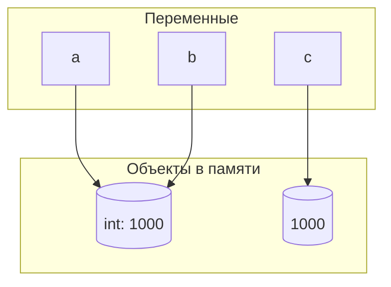

# Задание 1

### Часть 1

В repl результат появляется автоматически потому что задача repl вывести ответ,  
а задача файла выполнить программу пользователя, и если пользователь не дал команду вывода, файл этого не сделает.  
Чтобы вывести значение в файле, нужно добавить команду  
```python
print()
```

### Часть 2

Инструкции: *course = "Python"*, _hours = 4 * 2_, _print(f"{course}: {hours} часов")_  
Выражения: _Python_, _4 * 2_, все что в f-строке  
Литералы: _4_, _2_, _часов_  
Создаваемые имена: _course_, _hours_  


# Задание 2

#### №1


#### №2

Идентичность значений говорит о том, что две переменный ссылаются на одну и ту же ячейку памяти.  
Если переменные равны, то обекты не обязательно идентичны.

#### №3


#### №4

Строчка $\color{purple}{\text{python}}$ ушла в словарь интернированных слов для оптимизации,  
поэтому обе переменные ссылаются на одну интернированную строку.

#### №5

$\color{purple}{\text{is}}$ нужен для сравнения с уже существующими в памяти объектами.  
== нужен для сравнения всего остального когда нужно сравнивать именно значения объектов.

### Ответы На Вопросы

1. Нет, не создает. Две переменные ссылаются на один объект
2. $\color{purple}{\text{type()}}$ возвращает тип объекта, $\color{purple}{\text{id()}}$ возвращает адрес объекта в памяти
3. $\color{purple}{\text{None}}$ мы сравниваем с помощью $\color{purple}{\text{is}}$ т.к. это быстрее и с большей вероятностью не вызовет бага,
ведь объект None изначально всегда существует, а $\color{purple}{\text{==}}$ удобнее сравнивать переменные остальных типов данных
потому что нас интересуют именно их значения.

# Задание 3

### Эксперимент A

1. / используется для деления с плавающей точкой, стобы дать максимально точной результат при нецелочисленном делении (с остатком).
2. // используется, чтобы получить целую часть от деления. Если оба операнда типа $\color{red}{\text{int}}$, результат тоже будет этого же типа, но если хоть одно число будет типа $\color{red}{\text{float}}$, то и результатом будет целое число, но типа $\color{red}{\text{float}}$.

### Эксперимент B

В Python используется переменная разрядность. Это значит, что число может расти до тех пор, пока позволяет оперативная память.

### Эксперимент C

Чтобы записать число с бесконечным количеством знаков в память (например 1/3) его приходиться "усекать", из за чего происходит небольшая погрешность. Чтобы безопасно сравнить числа типа $\color{red}{\text{float}}$ нужно использовать данную функцию:
```python
math.isclose()
```
Она смотрит, насколько "близко" числа стоят друг к другу. Если достаточно, она выдаст 
$\color{purple}{\text{True}}$

### Эксперимент D

$\color{red}{\text{bool}}$ выводит $\color{purple}{\text{True}}$ для любой непустой строки.

## Контрольные вопросы

1. Только если делить их через _/_, потому что эта функция для максимально точного деления, что и обеспечивает плавающая точка.
2. $\color{purple}{\text{int("42")}}$ преобразует строку в число, а $\color{purple}{\text{int(42.9)}}$ берет целую часть от числа типа $\color{red}{\text{float}}$
3. Только $\color{red}{\text{bool(0)}}$ и $\color{red}{\text{bool("")}}$


# Задание 4


**TypeError: 'str' object does not support item assignment**
Ошибка возникла из-за того, что невозможно перезаписать данные типа $\color{red}{\text{str}}$ если они уже созданы в памяти. Это запрещено на уровне интерпретатора.

## Ответы на контрольные вопросы

1. $\color{purple}{\text{len()}}$ для обычной строки показывает количество символов в ней, а для байтовой сроки считает количество байт, выделенных для кодировки.
2.   (1) $\color{green}{\text{star}}$ (2) $\color{green}{\text{stop}}$ (3) $\color{green}{\text{step}}$
     - начало среза
     - конец среза
     - шаг (интервал) движения по строке
3. Методы $\color{purple}{\text{upper()}}$ и $\color{purple}{\text{lower()}}$ не меняют исходную строку, а создают новую. Изначальная строка останется прежней.

# Задание 5

1. Объекты
   - username, test_name, line — str
   - test_cnt — int
   - test_sec, real_x, imag_y, sum_sec, sum_min, modul_sqr — float
   - complex_coef — complex
   - has_runs — bool

2. **modul_sqr = real_x ** 2 + (complex_coef.imag) ** 2**
    - Литералы: _2_
    - Имена: _modul_sqr_, _real_x_, _complex_coef_
    - Операторы: _=_, _**_, _+_
    - Вызовы функции отсутствуют
      
3. Путь программы
  ```mermaid
  graph TD
    subgraph Step1 [Исходный файл]
        A["sum_sec = test_sec * test_cnt"]
    end

    subgraph Step2 [Разбор текста]
        B["Разбиение на токены:<br>• Имя: 'sum_sec'<br>• Оператор: '='<br>• Имя: 'test_sec'<br>• Оператор: '*'<br>• Имя: 'test_cnt'"]
    end

    subgraph Step3 [AST]
        C["Узел: Присваивание (=)"]
        C1["Левая ветвь:<br>Имя ('sum_sec')"]
        C2["Правая ветвь:<br>Бинарная операция (*)"]
        C2_L["Левый операнд:<br>Имя ('test_sec')"]
        C2_R["Правый операнд:<br>Имя ('test_cnt')"]
        
        C --> C1
        C --> C2
        C2 --> C2_L
        C2 --> C2_R
    end

    subgraph Step4 [Байткод]
        D["Инструкции для CPython:<br>1. LOAD_NAME (test_sec)<br>2. LOAD_NAME (test_cnt)<br>3. BINARY_OP (*)<br>4. STORE_NAME (sum_sec)"]
    end

    subgraph Step5 [CPython]
        E["Выполнение инструкций в памяти<br>и вывод результата на экран"]
    end

    A -->|"Парсер читает символы"| B
    B -->|"Проверка грамматики"| C
    C2_R -->|"Компилятор транслирует дерево"| D
    D -->|"Интерпретатор выполняет"| E

  ```

4. Потому что  $\color{purple}{\text{input()}}$ по умолчанию создает строку, а мы не можем работать со строками как с объектами других типов. 

#### Ответ на контрольный вопрос
    - На уровне объектов старое значение переменной останется, но еще создастся новый объект. Если на предыдущий никто не ссылается, то через какое-то время он будет удален чтобы оптимизировать систему
    - Сама переменная не поменяется, она просто поменяет ссылку.
    
