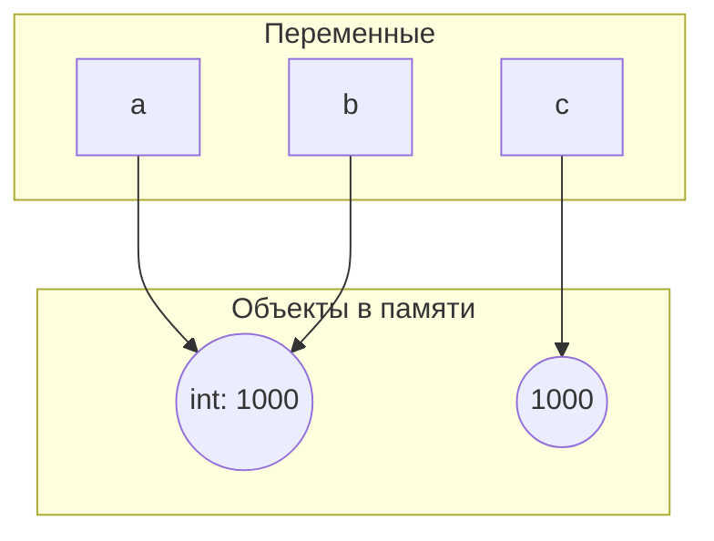

# Задание 1

### Часть 1

В repl результат появляется автоматически потому что задача repl вывести ответ,  
а задача файла выполнить программу пользователя, и если пользователь не дал команду вывода, файл этого не сделает.  
Чтобы вывести значение в файле, нужно добавить команду  
```python
print()
```

### Часть 2

Инструкции: *course = "Python"*, _hours = 4 * 2_, _print(f"{course}: {hours} часов")_  
Выражения: _Python_, _4 * 2_, все что в f-строке  
Литералы: _4_, _2_, _часов_  
Создаваемые имена: _course_, _hours_  


# Задание 2

#### №1


#### №2

Идентичность значений говорит о том, что две переменный ссылаются на одну и ту же ячейку памяти.  
Если переменные равны, то обекты не обязательно идентичны.

#### №3


#### №4

Строчка _python_ ушла в словарь интернированных слов для оптимизации,  
поэтому обе переменные ссылаются на одну интернированную строку.

#### №5

_Is_ нужен для сравнения с уже существующими в памяти объектами.  
== нужен для сравнения всего остального когда нужно сравнивать именно значения объектов.

### Ответы На Вопросы

1. Нет, не создает. Две переменные ссылаются на один объект
2. type() возвращает тип объекта, id() возвращает адрес объекта в памяти
3. None мы сравниваем с помощью is т.к. это быстрее и с большей вероятностью не вызовет бага,
ведь объект None изначально всегда существует, а == удобнее сравнивать переменные остальных типов данных
потому что нас интересуют именно их значения.
